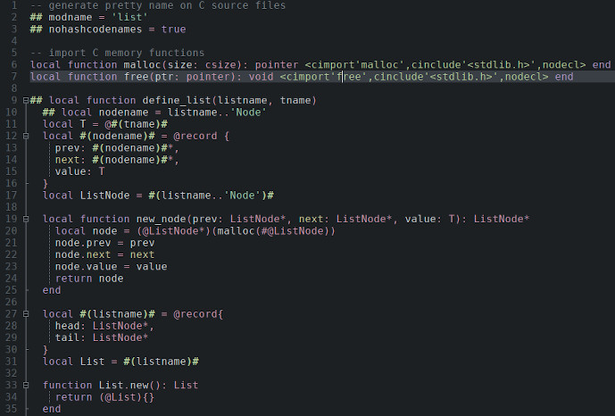

# ta-nelua

** NOTE: This is now unmaintained, feel free to create a fork and continue it.**

Lexer to add [Nelua](https://nelua.io/) support to [Textadept](https://foicica.com/textadept/) editor.

## How to install

* Clone or download the repository;
* Move the lexer/nelua.lua file to *_USERHOME*/lexers/ directory;
* Move the ta-nelua directory to *_USERHOME*/modules/ directory;
* Add this line to your *_USERHOME*/init.lua: ``require("ta-nelua")``;

(*_USERHOME* is your textadept userhome directory, by default, ~/.textadept/ or  C:\Users\username\.textadept)

## Usage

When opening any .nelua file, the nelua lexer will be selected automatically.

To run or compile a file, you can:
* use Ctrl+R to run; Shift+Ctrl+R to compile;
* go to Tools -> Run to run; Tools -> Compile to compile

If your file is on a VCS (Bazaar, Git, Mercurial, or SVN) directory, the root of the VCS project will be considered the working directory to run/compile.

Consult *Compile, Run, and Build* section of [Textadept's Manual](https://foicica.com/textadept/manual.html) to more information.

## Preview

